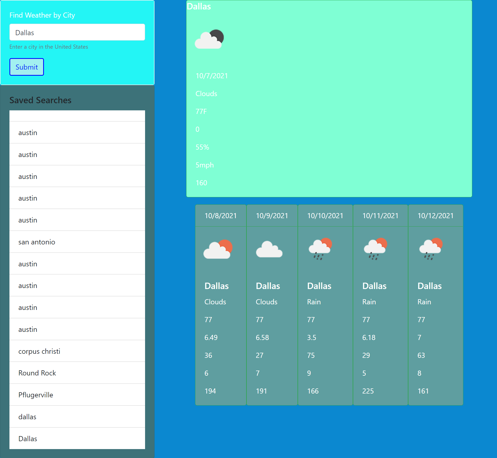
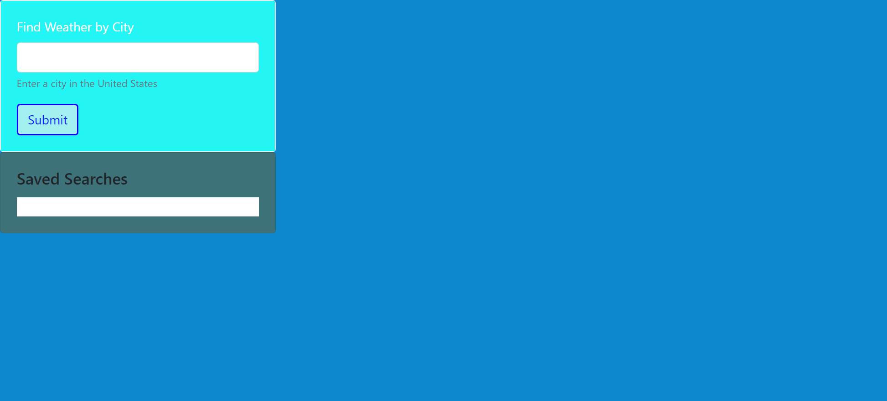

# Your Local 5 Day Weather Report

# Weather Dash Board home work assignment

## Task: Create a Weather dash board for those with a travel often and need to look ahead at the incoming weather forecast from any city in the united states, and even the user can even see most recent searches!

## Languages / Systems used to complete this assignment

1. JavaScript
2. HTML
3. CSS
4. Git
5. Jquery
6. BootStrap

# screen shots

# links

- [deployed website](https://chris79kennard.github.io/Weather-Dash-Board-/)
- [repository](https://github.com/chris79kennard/Weather-Dash-Board-)
